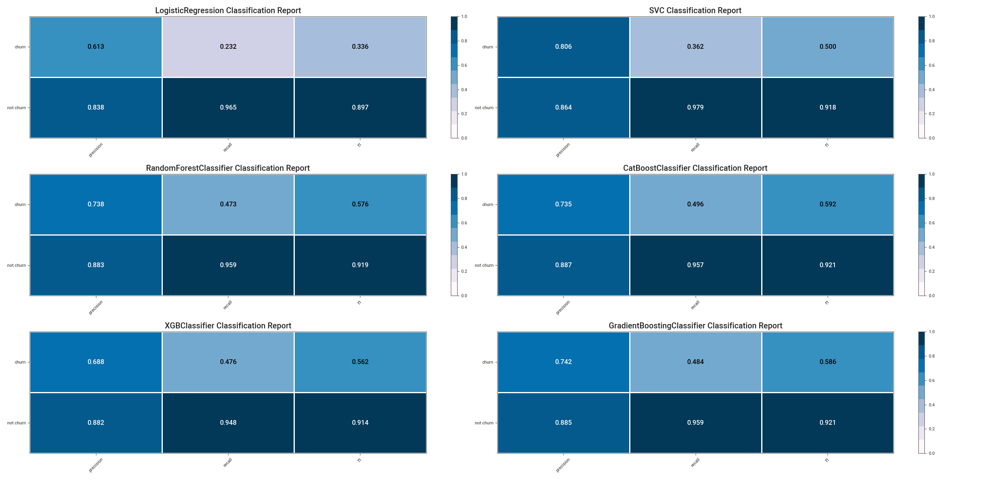
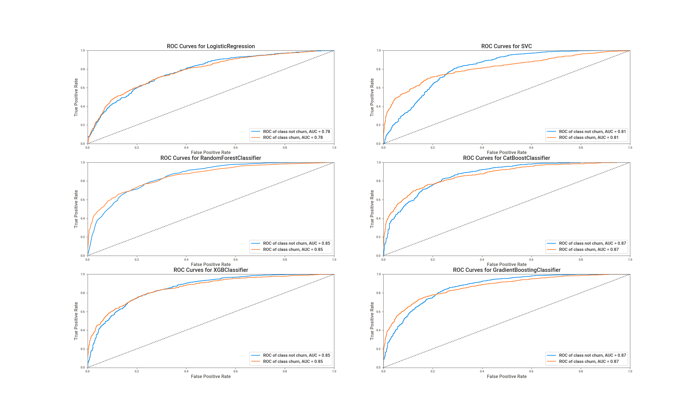
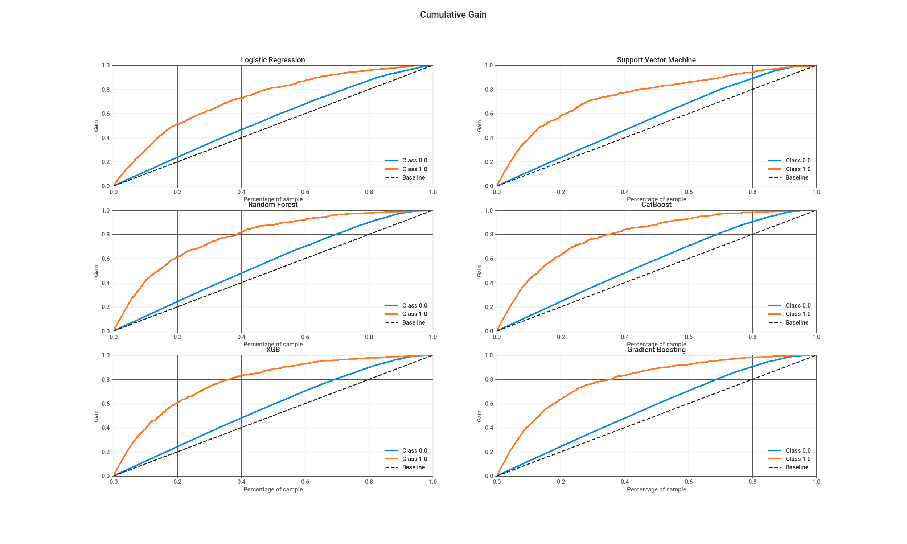
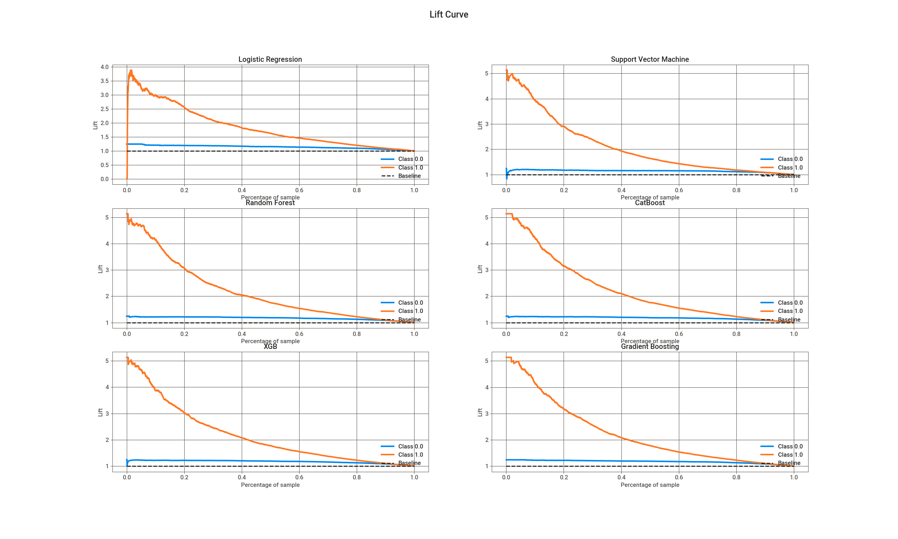
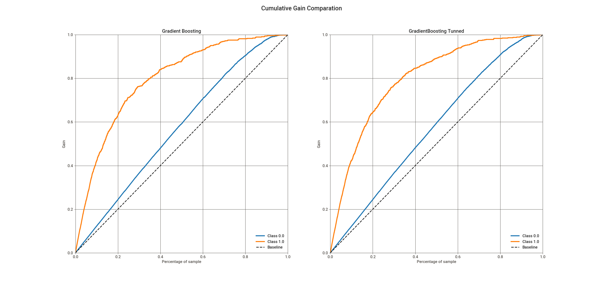
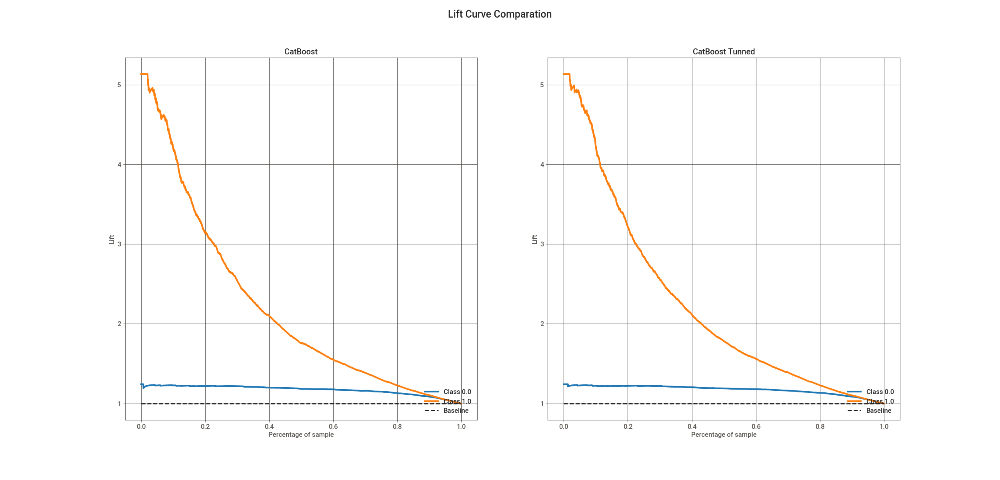

# <b>Client Churn Prediction</b>

    

---
## 1. Business Problem

> Disclaimer: This is a fictional bussiness case

The Top Bank company operates in Europe with a bank account as the main product, this product can keep client's salary and make payments. This account doesn't have any cost in the first 12 months, however, after that time trial, the client needs to rehire the bank for upcoming 12 months and redo this process every year. Recently the Analytics Team noticed that the churn rate is increasing.

### 1.1 Challenge
As a Data Scientist, you need to create an action plan to decrease the number of churn customers and show the financial return on your solution.
In addition, you will need to provide a report reporting your model's performance and the financial impact of your solution. 
Questions that the CEO and the Analytics team would like to see in their report:

1.  What is Top Bank's current Churn rate?
2. What is the performance of the model in classifying customers as churns?
3. What is the expected return, in terms of revenue, if the company uses its model to avoid churn from customers?

---
## 2. Dataset
The dataset is available on: https://www.kaggle.com/mervetorkan/churndataset

**Data fields**

- **RowNumber**: the number of the columns
- **CustomerID**: unique identifier of clients
- **Surname**: client's last name
- **CreditScore**: clien'ts credit score for the financial market
- **Geography**: the country of the client
- **Gender**: the gender of the client
- **Age**: the client's age
- **Tenure**: number of years the client is in the bank 
- **Balance**: the amount that the client has in their account 
- **NumOfProducts**: the number of products that the client bought 
- **HasCrCard**: if the client has a credit card 
- **IsActiveMember**: if the client is active (within the last 12 months) 
- **EstimateSalary**: estimative of anual salary of clients 
- **Exited**: if the client is a churn (*target variable*)
---
## 3. Solution Strategy
To Answers the Analytics Team and CEO questions, An exploratory data analysis will be performed, after that, a machine learning model will be developed following the strategy to answer this:

1. Which customer will be in churn:
    - What is the criterion?
        - Downtime
        - Time remaining until the contract ends

2. Current churn rate of the company:
    - Calculate churn rate
    - Calculate monthly churn rate and variation

3. Performance of the model:
    - Precision at K score
    - Recall at K score

4. Action plan:
    - Discount?
    - Voucher?
    - Deposit bonus?

### 3.1 Steps

**Step 01. Data Description:**  Use descriptive statistics metrics to measure data distribution

**Step 02. Feature Engineering:** Create features to describe the fenomenous.

**Step 03. Data Filtering:**  Filter the features values to make ML modelling easier.

**Step 04. Exploratory Data Analysis:** Find insights to better describe the fenomenous and brake wrong concepts.

**Step 05. Data Preparation:**  Select the most important features and prepare the data to the step 6.

**Step 06. Machine Learning Modelling:** Machine Learning model selection and training.

**Step 07. Hyperparameter Fine Tunning:** Find the best values of each parameter of the model.

**Step 08. Final Model:** Select the best parameters and prove that it brings good results.

**Step 09. Business Translation:** Convert the machine learning performance into business result.

---

## 4. Mind Map Hypothesis

    

## 5. Top 3 Data Insights

**Insight 01:** Clients with more products has more tendency to be churn.

**Insight 02:** In proportion, clients with 60 years and above has more tendency to be in churn than adolescents and adults.

 
 
**Insight 03:** Stores sell less in the second half of the year.
    
| Life stage  | Churn % |
| ----------- | ------- |
| Adolescence | 5.618   |
| Adulthood   | 8.189   |
| Middle Age  | 23.827  |
| Senior      | 43.710  |

 

---

## 6. Machine Learning Model Applied

The tested models are:

- Logistic Regression
- Support Vector Machine
- Random Forest Classifier
- XGBoost Classifier
- CatBoost Classifier
- Gradient Boosting Classifier

As a classification problem with imbalanced data, [the accuracy of the model alone doesn't tell us much](https://medium.com/data-hackers/indo-além-da-acurácia-entendo-a-acurácia-balanceada-precisão-recall-e-f1-score-c895e55a9753), for a better analysis, we use other metrics such as accuracy, recall and F1-Score.

The ROCAUC shows how much the algorithm is capable of distinguishing between classes.

Using the Cross Validation with 10 parts, The mean F1-Score result of the CatBoostClassifier and GradientBoostingClassifier 
show that the two models really are the ones with the best results for this case.

In XGB, Random Forest, Catboost and Gradient Boosting, if 20% of the clients in the sample are contacted, about 60% of the in churn clients are most likely to respont to a offer.

- The lift curve uses the returned probability of a classification model to measure how the model is performing.
- The highest probability appear on the left of the graph, usually along with the highest Lift scores.
- The greater the area between the lift curve and the baseline, the better the model.

You can see this [here](https://towardsdatascience.com/the-lift-curve-unveiled-998851147871).

The best model in this case was the CatBoost Classifier.

## 7. Machine Learning Performance

The performance of the tunned model was slighty higher than the basic CatBoost, you can see that in the confusion matrix where the basic model is on the left and the tunned on the other side. Despite the low gain in accuracy and precision, the tuned model has better results, and you need to remember that we are dealing with a very imbalanced dataset.

| CatBoostClassifier | Accuracy | Precision | Recall | F1-Score | ROCAUC |
| ------------------ | -------- | --------- | ------ | -------- | ------ |
| Basic              | 86.7%    | 73.5%     | 49.6%  | 59.2%    | 86.6%  |
| Tunned             | 86.9%    | 75.4%     | 49%    | 59.4%    | 87.2%  |

After the comparation, I tried to use a post-processing operation called model calibration, this method tries to improve the probability estimation with a calibration method, in this case, the Isotonic method. According the [reference](https://towardsdatascience.com/classifier-calibration-7d0be1e05452), the accuracy and rocauc of the model might be lower after calibration. If the Precision, Recall or F1 have a significant increase, we can use the calibrated as the final model, if not, we will keep the tuned model.

| CatBoostClassifier | Accuracy | Precision | Recall | F1-Score | ROCAUC |
| ------------------ | -------- | --------- | ------ | -------- | ------ |
| Tunned             | 86.9%    | 75.4%     | 49%    | 59.4%    | 87.2%  |
| Calibrated         | 86.8%    | 75.5%     | 47.9%  | 58.6%    | 87.1%  |

According this [reference](https://en.wikipedia.org/wiki/Precision_and_recall), higher precision means that an algorithm returns more relevant results than irrelevant ones, and high recall means that an algorithm returns most of the relevant results. The precision increased 0.1% and Recall decreased 1.1%, so I think it's better to keep the basic tunned model. The small increase in precision doesn't justify the calibration process. So, the final model is the CatBoost Tunned.

---

## 8. Bussiness Performance

---

## 9. Lessons Learned

## 10. Next Steps

- Test other simulation with other budgets in order to search better scenarios
- Train other models in search to better results in precision, recall and F1-Score
- If can get more data, experiment data balance for a better performance

