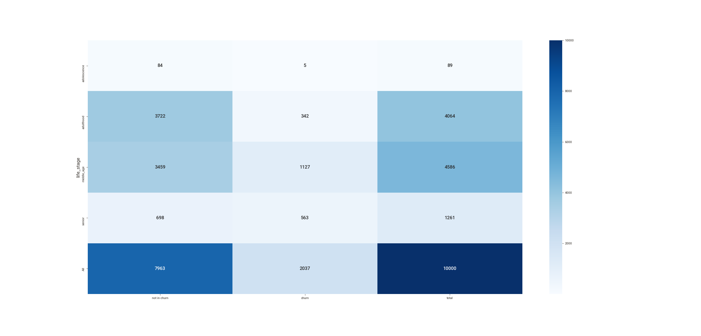

# <b>Client Churn Predict</b>

    

---
## 1. Business Problem

> Disclaimer: This is a fictional bussiness case

The Top Bank company operates in Europe with a bank account as the main product, this product can keep client's salary and make payments. This account doesn't have any cost in the first 12 months, however, after that time trial, the client needs to rehire the bank for upcoming 12 months and redo this process every year. Recently the Analytics Team noticed that the churn rate is increasing.

### 1.1 Challenge
As a Data Scientist, you need to create an action plan to decrease the number of churn customers and show the financial return on your solution.
In addition, you will need to provide a report reporting your model's performance and the financial impact of your solution. 
Questions that the CEO and the Analytics team would like to see in their report:

1.  What is Top Bank's current Churn rate?
2. What is the performance of the model in classifying customers as churns?
3. What is the expected return, in terms of revenue, if the company uses its model to avoid churn from customers?

---
## 2. Dataset
The dataset is available on: https://www.kaggle.com/mervetorkan/churndataset

**Data fields**

- **RowNumber**: the number of the columns
- **CustomerID**: unique identifier of clients
- **Surname**: client's last name
- **CreditScore**: clien'ts credit score for the financial market
- **Geography**: the country of the client
- **Gender**: the gender of the client
- **Age**: the client's age
- **Tenure**: number of years the client is in the bank 
- **Balance**: the amount that the client has in their account 
- **NumOfProducts**: the number of products that the client bought 
- **HasCrCard**: if the client has a credit card 
- **IsActiveMember**: if the client is active (within the last 12 months) 
- **EstimateSalary**: estimative of anual salary of clients 
- **Exited**: if the client is a churn (*target variable*)
---
## 3. Solution Strategy
To Answers the Analytics Team and CEO questions, An exploratory data analysis will be performed, after that, a machine learning model will be developed following the strategy to answer this:

1. Which customer will be in churn:
    - What is the criterion?
        - Downtime
        - Time remaining until the contract ends

2. Current churn rate of the company:
    - Calculate churn rate
    - Calculate monthly churn rate and variation

3. Performance of the model:
    - Precision at K score
    - Recall at K score

4. Action plan:
    - Discount?
    - Voucher?
    - Deposit bonus?

### 3.1 Steps

**Step 01. Data Description:**  Use descriptive statistics metrics to measure data distribution

**Step 02. Feature Engineering:** Create features to describe the fenomenous.

**Step 03. Data Filtering:**  Filter the features values to make ML modelling easier.

**Step 04. Exploratory Data Analysis:** Find insights to better describe the fenomenous and brake wrong concepts.

**Step 05. Data Preparation:**  Select the most important features and prepare the data to the step 6.

**Step 06. Machine Learning Modelling:** Machine Learning model selection and training.

**Step 07. Hyperparameter Fine Tunning:** Find the best values of each parameter of the model.

**Step 08. Final Model:** Select the best parameters and prove that it brings good results.

**Step 09. Business Translation:** Convert the machine learning performance into business result.
---

## 4. Mind Map Hypothesis

    

---

## 5. Top 3 Data Insights

**Insight 01:** Clients with more products has more tendency to be churn.

**Insight 02:** In proportion, clients with 60 years and above has more tendency to be in churn than adolescents and adults.

 
 
**Insight 03:** Stores sell less in the second half of the year.
    
| Life stage  | Churn % |
| ----------- | ------- |
| Adolescence | 5.618   |
| Adulthood   | 8.189   |
| Middle Age  | 23.827  |
| Senior      | 43.710  |

 

---

## 6. Machine Learning Model Applied

The tested models are:

- Logistic Regression
- Support Vector Machine
- Random Forest Classifier
- XGBoost Classifier
- CatBoost Classifier
- Gradient Boosting Classifier

The best model in this case was the CatBoost Classifier.

---
